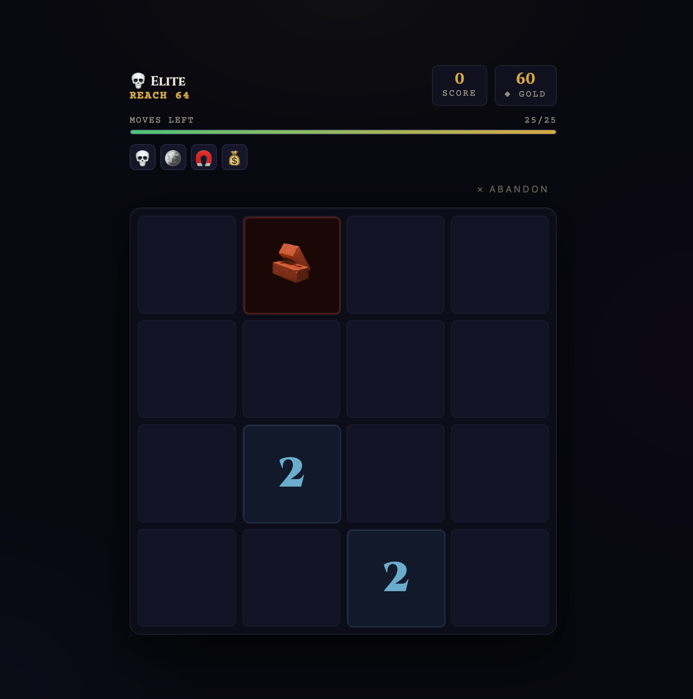

# 2048 Rogue Ascension

A roguelike variant of 2048 with meta-progression, relics, and an ascension system. Built as a static vanilla JS game — no framework, no build step.

<p align="center">
  
  
  
</p>

## How to Play

Open `index.html` in a browser. Swipe or use arrow keys / WASD / ZQSD to move tiles.

Each **run** spans 3 floors. Each floor has a Slay-the-Spire-style node map with battles, elite rooms, mystery events, rest stops, and a boss. Complete room objectives (reach a tile value, score targets, merge counts) within a limited number of moves.

## Features

- **Roguelike runs** — 3 floors of connected nodes with branching paths
- **29 relics** — 7 common, 6 rare, 6 epic, 4 legendary, 6 curses. Rarity-weighted drops that scale by floor
- **Hook-based relic system** — adding a relic is a single entry in `constants.js`, no other files to touch
- **Meta-progression** — spend gold on permanent upgrades in the Forge of Fate
- **Ascension system** — 3 prestige tiers that reset upgrades and unlock new passives
- **Mystery rooms** — 9+ weighted random events including gold, relics, curses, traps, and ambush combat
- **Special tiles** — obstacles (block movement), bombs (timed explosions)
- **Bilingual** — French and English, switchable from the title screen
- **Mobile-first** — touch swipe controls, 440px max width, responsive

## Tech Stack

Vanilla JS, single CSS file, no dependencies. ~1500 lines of game logic across 8 modules:

```
constants → storage → state → board → renderer → controller → input
     ↑
   i18n (loaded first)
```

## Architecture

| File | Role |
|---|---|
| `i18n.js` | Translation system (FR/EN), `I18n.t(key, params)` |
| `constants.js` | Game data: relics, upgrades, objectives, hook runner |
| `storage.js` | localStorage persistence |
| `state.js` | Runtime game state singleton |
| `board.js` | 4×4 grid logic: slide, merge, obstacles, bombs |
| `renderer.js` | All DOM manipulation, tile pool, map SVG |
| `controller.js` | Game flow: runs, rooms, moves, relics, ascension |
| `input.js` | Touch, keyboard, button bindings, boot |

## License

MIT
