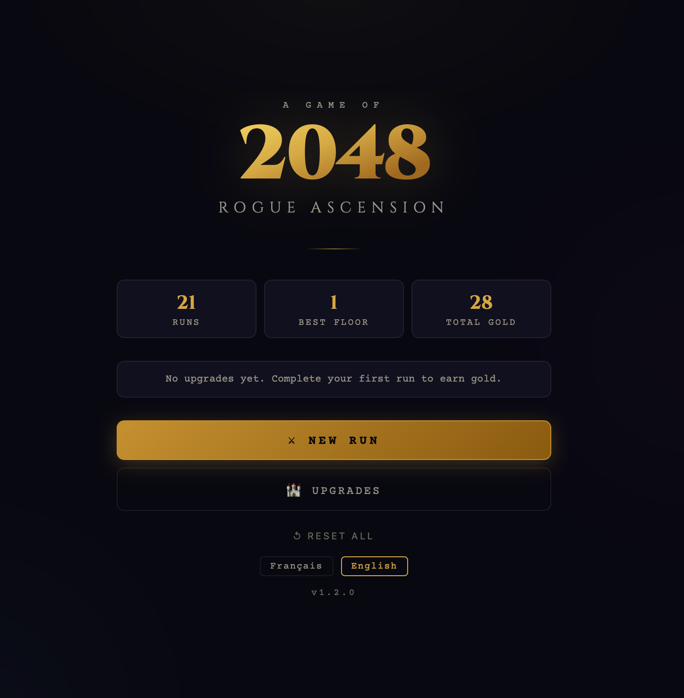
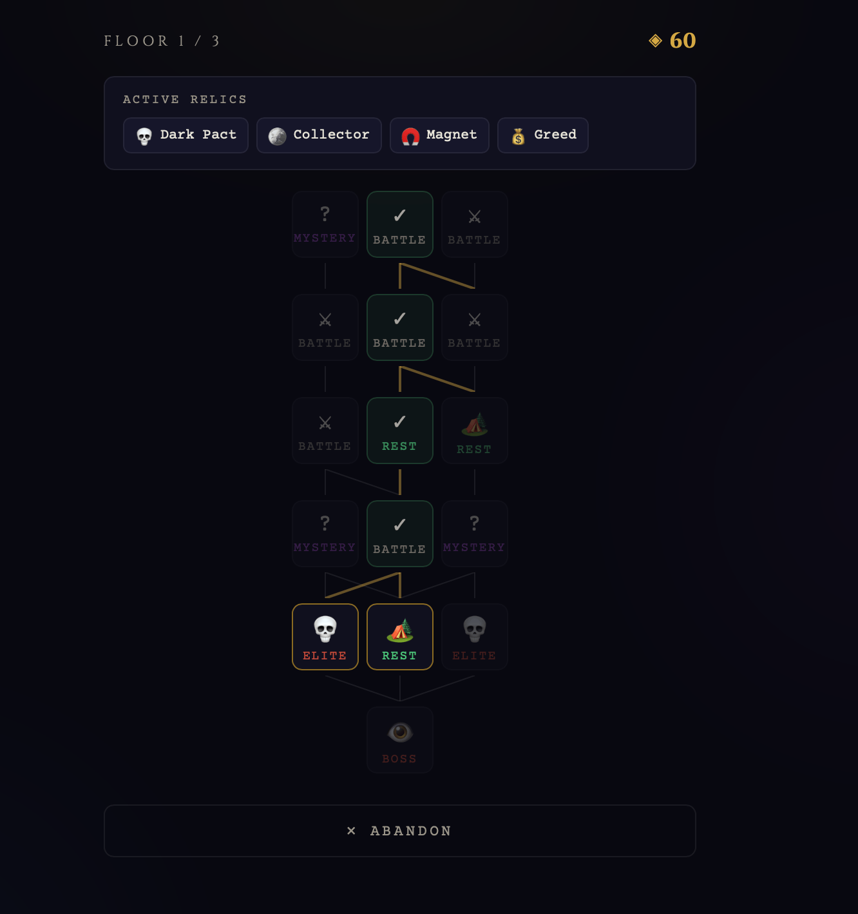
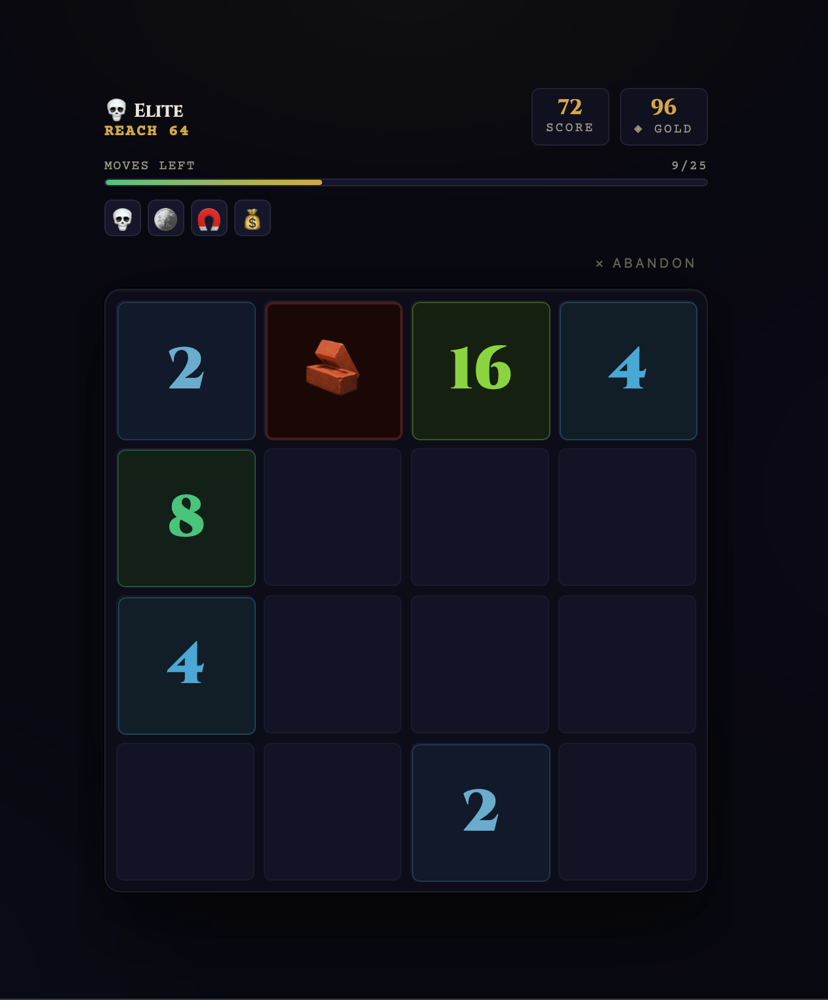

# 2048 Rogue Ascension

A roguelike variant of 2048 with meta-progression, relics, and an ascension system. Built as a static vanilla JS game – no framework, no build step.

<p align="center">
  
  
  
</p>

## How to Play

Open `index.html` in a browser. Swipe or use arrow keys / WASD / ZQSD to move tiles.

Each **run** spans 3 floors. Each floor has a branching node map with battles, elite rooms, mystery events, rest stops, and a boss. Merge tiles to damage enemies before your moves run out. Enemy intents show what happens next and when; three hearts let you survive failed rooms.

## Features

- **Roguelike runs** – 3 floors of connected nodes with branching paths
- **29 relics** – 7 common, 6 rare, 6 epic, 4 legendary, 6 curses. Rarity-weighted drops that scale by floor
- **Hook-based relic system** – adding a relic is a single entry in `constants.js`, no other files to touch
- **Meta-progression** – spend gold on permanent upgrades in the Forge of Fate
- **Ascension system** – 3 prestige tiers that reset upgrades and unlock new passives
- **Mystery rooms** – 9+ weighted random events including gold, relics, curses, traps, and ambush combat
- **Special tiles**: gold tiles pay on merges; ice blocks until two adjacent merges thaw it; jokers merge with numbered tiles; ×2 doubles a numbered tile. Obstacles block movement, bombs halve adjacent numbers and destroy jokers or ×2 tiles, and floor III battles place paired portals. Prophet and Herald can freeze numbered tiles. Gold, joker and ×2 are fully implemented; their creation sources arrive in later versions.
- **Combat**: enemy HP, combo damage, block, temporary seals, telegraphed intents and boss phases
- **Bilingual** – French and English, switchable from the title screen
- **Mobile-first** – touch swipe controls, 440px max width, responsive
- **Sensation** – gem tiles, merge particles, floating values, shake, and screen motion
- **Procedural sound** – pentatonic merge notes and room cues, with a persistent toggle
- **Seeded runs** – reproducible maps and tile spawns; the run seed appears on the end screen
- **Dungeon art direction**: hand-drawn "fine engraving" SVG icons, and a drifting fog backdrop per scene: each floor (Crypts, Sunken Forge, Abyss) and each named boss has its own palette and emblem

## Tech Stack

Vanilla JS, single CSS file, no dependencies:

```
haptics → i18n → icons → rng → constants → storage → state → board → combat → fx → scene → audio → renderer → controller → input
```

## Architecture

| File | Role |
|---|---|
| `i18n.js` | Translation system (FR/EN), `I18n.t(key, params)` |
| `rng.js` | Seeded game randomness |
| `constants.js` | Game data: relics, upgrades, enemies, hook runner |
| `storage.js` | localStorage persistence for meta progression and active runs |
| `state.js` | Runtime game state singleton |
| `board.js` | 4×4 grid logic: slide, merge, obstacles, bombs |
| `combat.js` | Pure combat rules: HP, intents, phases, seals and hearts |
| `fx.js` | Canvas particles and DOM feedback |
| `audio.js` | WebAudio effects |
| `renderer.js` | All DOM manipulation, tile pool, map SVG |
| `controller.js` | Game flow: runs, rooms, moves, relics, ascension |
| `input.js` | Touch, keyboard, button bindings, boot |

Run `npm test` for board and combat checks. Run `npm run balance` for the 300-seed-per-enemy greedy bot report.

## License

MIT

The board keeps numeric tile values and a parallel `kinds` grid for gold and ice. `Board.applyMove(board, dir, { kinds, iceHits })` moves both and returns merge payouts and a shared movement map for bomb timers. Active battles save kinds, portal cells and ice cracks; older saves resume with empty defaults.
